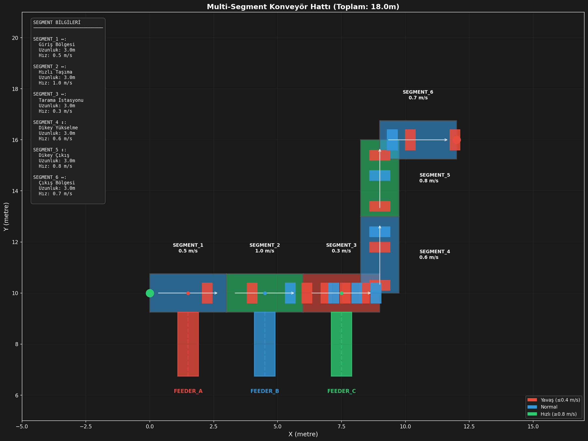
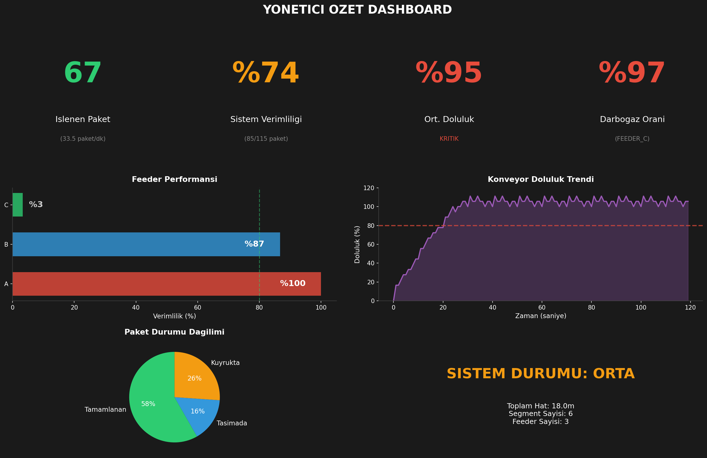

# Konveyör Bant Lojistik Davranış Simülasyonu

[](https://www.python.org/downloads/)
[](https://simpy.readthedocs.io/)
[](https://opensource.org/licenses/MIT)

Ana konveyör ağlarında birden fazla besleme hattı (feeder line) ile **kapasite** ve **koordinasyon** problemlerini analiz eden 2D lojistik simülasyon sistemi.


## İçindekiler

- [Proje Hakkında](#proje-hakkında)
- [Problem Tanımı](#problem-tanımı)
- [Sistem Mimarisi](#sistem-mimarisi)
- [Kurulum](#kurulum)
- [Kullanım](#kullanım)
- [Konfigürasyon](#konfigürasyon)
- [Çıktılar ve Görselleştirmeler](#çıktılar-ve-görselleştirmeler)
- [Ölçüm Metrikleri](#ölçüm-metrikleri)
- [Proje Yapısı](#proje-yapısı)
- [Gelecek Geliştirmeler](#gelecek-geliştirmeler)

## Proje Hakkında

Bu proje, endüstriyel konveyör bant sistemlerinin davranışını simüle etmek için geliştirilmiştir. Özellikle:

- **Feeder Lines (Besleme Hatları)**: Ana konveyöre dik açıyla bağlanan tek yönlü besleme hatları. Sisteme yeni paketlerin beslenmesini sağlar.
- **Main Conveyor Network (Ana Konveyör Ağı)**: Yatay ve dikey uzanan ana taşıma hatları. Paketleri taşıma, birleştirme ve dağıtım işlevlerini yerine getirir.
- **İşlem İstasyonları**: Paketlerin işlendiği, yönlendirildiği veya depolandığı noktalar.

### Simülasyon Süreci

1. Feeder line'lar belirli frekansta paket üretir
2. Paketler ana konveyör ağına aktarılmak için bekler
3. Ana konveyörde yer varsa paket aktarılır, yoksa feeder line beslemeyi durdurur (bloke olur)
4. Paketler ana hat üzerinde taşınır
5. Birleşme noktalarından diğer paketlerle birleşir
6. Dağıtım noktalarından hedeflerine yönlendirilir

## Problem Tanımı

### Kapasite Problemi

| Problem | Açıklama |
|---------|----------|
| Konveyör Kapasitesi | Ana konveyörlerin sınırlı kapasitesini feeder line hızları doğrultusunda en verimli şekilde kullanmak |
| Deadlock Tespiti | Feeder line ve ana konveyör birleşme noktalarında hangi besleme periyodunda sistem kilitlenir? |
| Yığılma Analizi | Feeder line - ana konveyör gecikme süresi çıkartılırken işlem istasyonlarından çıkan paketlerde yığılma yaşanabilir |

### Koordinasyon Problemi

| Problem | Açıklama |
|---------|----------|
| Zamanlama | Feeder line'lar ne zaman beslemeye çıkacak? |
| Öncelik Mekanizması | Priority mechanism dahil edilmeli mi? |
| Optimizasyon Hedefi | Optimal throughput mu, adil dağıtım mı? |

### Kapasite Hesaplama Formülü

```
Kapasite = Konveyör Uzunluğu / (Paket Uzunluğu + Paketler Arası Mesafe)
```

**Örnek**: 50m konveyör, 0.3m paket, 0.5m minimum mesafe için:
```
Kapasite = 50 / (0.3 + 0.5) = 62.5 ≈ 62 paket
```

## Sistem Mimarisi

### Multi-Segment Konveyör Hattı

Sistem, farklı hızlara ve yönlere sahip segmentlerden oluşan bir konveyör hattı kullanır:

```
┌─────────────────────────────────────────────────────────────────────────┐
│                     MULTI-SEGMENT KONVEYÖR HATTI                        │
│                                                                         │
│  SEGMENT_1    SEGMENT_2    SEGMENT_3         SEGMENT_6                  │
│  (0.5 m/s)    (1.0 m/s)    (0.3 m/s)         (0.7 m/s)                  │
│  ═══════════►═══════════►═══════════►┐    ┌═══════════►                 │
│      ▲            ▲            ▲      │    │                            │
│      │            │            │      │    │  SEGMENT_5                 │
│  FEEDER_A    FEEDER_B    FEEDER_C     │    │  (0.8 m/s)                 │
│                                       │    ▲                            │
│                              SEGMENT_4│    │                            │
│                              (0.6 m/s)▼────┘                            │
└─────────────────────────────────────────────────────────────────────────┘
```

### Temel Bileşenler (Eski Mimari)

```
┌─────────────────────────────────────────────────────────────────┐
│                        ANA KONVEYÖR                             │
│  ════════════════════════════════════════════════════════════►  │
│       ▲           ▲           ▲                                 │
│       │           │           │                                 │
│  ┌────┴────┐ ┌────┴────┐ ┌────┴────┐                           │
│  │FEEDER_A │ │FEEDER_B │ │FEEDER_C │                           │
│  │(Kırmızı)│ │ (Mavi)  │ │ (Yeşil) │                           │
│  └─────────┘ └─────────┘ └─────────┘                           │
└─────────────────────────────────────────────────────────────────┘
```

### Sınıf Diyagramı

```
┌─────────────────┐     ┌─────────────────┐     ┌─────────────────┐
│     Packet      │     │  ConveyorLine   │     │   FeederLine    │
├─────────────────┤     ├─────────────────┤     ├─────────────────┤
│ - id            │     │ - id            │     │ - id            │
│ - length        │     │ - segments[]    │     │ - production_rate│
│ - position      │     │ - total_length  │     │ - target_conveyor│
│ - source_feeder │     │ - capacity      │     │ - queue         │
│ - path_history  │     │ - packets[]     │     │ - is_blocked    │
├─────────────────┤     ├─────────────────┤     ├─────────────────┤
│ + enter_conveyor│     │ + add_segment   │     │ + start_production│
│ + start_waiting │     │ + accept_packet │     │ + transfer_process│
│ + stop_waiting  │     │ + get_speed_at  │     │ + get_statistics │
└─────────────────┘     └─────────────────┘     └─────────────────┘

┌─────────────────┐
│ ConveyorSegment │
├─────────────────┤
│ - id            │
│ - length        │
│ - speed         │
│ - direction     │  ← "horizontal" veya "vertical"
│ - start_offset  │
├─────────────────┤
│ + has_space_at  │
│ + get_utilization│
└─────────────────┘
```

## Kurulum

### Gereksinimler

- Python 3.11 veya üzeri
- pip (Python paket yöneticisi)

### Adım Adım Kurulum

1. **Projeyi klonlayın**
   ```bash
   git clone https://github.com/UstekRFID/ConveyorBelt_LogisticSimulation.git
   cd ConveyorBelt_LogisticSimulation
   ```

2. **Sanal ortam oluşturun** (önerilen)
   ```bash
   python -m venv .venv
   source .venv/bin/activate  # Linux/macOS
   # veya
   .venv\Scripts\activate     # Windows
   ```

3. **Bağımlılıkları yükleyin**
   ```bash
   pip install -r requirements.txt
   ```

4. **Kurulumu doğrulayın**
   ```bash
   python -c "import simpy; import matplotlib; print('Kurulum başarılı!')"
   ```

## Kullanım

### Temel Kullanım

Multi-segment simülasyonu çalıştırmak için:

```bash
python src/main_multiline.py
```

### Programatik Kullanım

```python
from src.main_multiline import MultiSegmentSimulation, load_config

# Varsayılan config ile
sim = MultiSegmentSimulation()
sim.setup()
sim.run()
sim.print_statistics()

# Özel config ile
config = load_config("config/custom_simulation.toml")
sim = MultiSegmentSimulation(config)
sim.setup()
sim.run(duration=60.0)  # 60 saniyelik simülasyon
```

### Görselleştirmeler

Simülasyon tamamlandıktan sonra otomatik olarak oluşturulan grafikler:

```python
sim.visualize_system_layout()         # 2D sistem düzeni (horizontal + vertical segmentler)
sim.visualize_executive_dashboard()   # KPI dashboard
sim.visualize_snapshot_frames()       # Zaman serisi snapshot'ları
sim.visualize_analysis()              # Segment bazlı analiz
sim.visualize_live()                  # Canlı animasyon
```

## Konfigürasyon

Tüm simülasyon parametreleri `config/simulation.toml` dosyasından yönetilir:

```toml
# Simülasyon Ayarları
[simulation]
duration = 120.0          # Simülasyon süresi (saniye)
snapshot_interval = 1.0   # Snapshot aralığı (saniye)

# Paket Varsayılan Özellikleri
[packet]
default_length = 0.3      # Metre
default_width = 0.3       # Metre
default_height = 0.3      # Metre
min_gap = 0.5             # Paketler arası minimum mesafe

# Görselleştirme Ayarları
[visualization]
theme = "dark"
dpi = 150
output_dir = "output/plots"

# Feeder Renkleri
[visualization.colors]
FEEDER_A = "#E74C3C"      # Kırmızı
FEEDER_B = "#3498DB"      # Mavi
FEEDER_C = "#2ECC71"      # Yeşil
FEEDER_D = "#F39C12"      # Turuncu

# Segment Renkleri (hıza göre)
[visualization.segment_colors]
slow = "#E74C3C"          # Kırmızı - yavaş (<0.4 m/s)
normal = "#3498DB"        # Mavi - normal
fast = "#2ECC71"          # Yeşil - hızlı (>=0.8 m/s)

# Multi-Segment Konveyör Hattı
[[conveyor_segments]]
id = "SEGMENT_1"
length = 3.0              # Metre
speed = 0.5               # Metre/saniye
direction = "horizontal"  # veya "vertical"
description = "Giriş Bölgesi"

[[conveyor_segments]]
id = "SEGMENT_2"
length = 3.0
speed = 1.0
direction = "horizontal"
description = "Hızlı Taşıma"

# ... daha fazla segment eklenebilir

# Feeder Line Tanımları
[[feeders]]
id = "FEEDER_A"
production_rate = 0.4     # paket/saniye
connection_segment = 0    # Hangi segmente bağlı (0-indexed)
connection_offset = 1.5   # Segment başından mesafe (metre)
max_queue_size = 100

[[feeders]]
id = "FEEDER_B"
production_rate = 0.3
connection_segment = 1
connection_offset = 1.5
max_queue_size = 100
```

### Yeni Segment Ekleme

```toml
[[conveyor_segments]]
id = "SEGMENT_NEW"
length = 3.0
speed = 0.7
direction = "vertical"    # Dikey segment
description = "Yeni Bölge"
```

### Yeni Feeder Ekleme

```toml
[[feeders]]
id = "FEEDER_D"
production_rate = 0.33    # Her 3 saniyede 1 paket
connection_segment = 2    # 3. segmente bağlı
connection_offset = 1.5   # Segment ortasında
max_queue_size = 50
```

## Çıktılar ve Görselleştirmeler

Simülasyon sonunda `output/plots/` dizininde aşağıdaki dosyalar oluşturulur:

### 1. Sistem Düzeni (`multisegment_layout.png`)



2D görünümde multi-segment konveyör hattı, feeder'lar ve paketler.

**İçerik:**
- Segmentler (hıza göre renklendirilmiş: kırmızı=yavaş, mavi=normal, yeşil=hızlı)
- Horizontal ve vertical segmentler
- Feeder line'lar (sarı border = bloke durumda)
- Paketler (kaynak feeder'a göre renklendirilmiş)
- Segment bilgileri (hız, uzunluk)

### 2. Executive Dashboard (`executive_dashboard.png`)



KPI özet paneli:

| Panel | İçerik |
|-------|--------|
| Feeder Verimliliği | Her feeder'ın aktif çalışma oranı |
| Segment Dolulukları | Her segmentin doluluk yüzdesi |
| Throughput | Birim zamanda işlenen paket sayısı |
| Özet Metrikler | Toplam üretim, aktarım, kuyruk |

### 3. Snapshot Frame'leri (`snapshot_frames.png`)

1 saniyelik aralıklarla alınan 2D anlık görüntüler. Sistemin zaman içindeki evrimini gösterir.

### 4. Segment Analizi (`multisegment_analysis.png`)

Segment bazlı detaylı analiz grafikleri.

## Ölçüm Metrikleri

### Ana Metrikler

| Metrik | Açıklama | Formül |
|--------|----------|--------|
| **Throughput (Geçiş Hızı)** | Birim zamanda çıkan paket sayısı | `işlenen_paket / süre` |
| **Utilization (Doluluk Oranı)** | Konveyör doluluk yüzdesi | `mevcut_paket / kapasite` |
| **Wait Time (Bekleme Süresi)** | Feeder kuyruğunda geçen süre | `aktarım_zamanı - üretim_zamanı` |
| **Block Time (Bloke Süresi)** | Feeder'ın bloke kaldığı süre | Toplam bloke süreleri |
| **Efficiency (Verimlilik)** | Aktif çalışma oranı | `1 - (bloke_süresi / toplam_süre)` |

### Örnek Çıktı

```
📊 SİMÜLASYON İSTATİSTİKLERİ
======================================================================

🎯 ANA KONVEYÖR: MAIN_CONVEYOR
   Toplam işlenen paket: 59
   Halen üzerinde: 52 paket
   Son doluluk oranı: 104.00%

📦 FEEDER LINES:

   FEEDER_A:
      Üretilen: 60 paket
      Aktarılan: 60 paket
      Kuyrukta: 0 paket
      Toplam bloke süresi: 0.0s
      Kullanım oranı: 100.00%
      Transfer hızı: 0.500 paket/s
      Bloke olma sayısı: 0

   FEEDER_B:
      Üretilen: 48 paket
      Aktarılan: 48 paket
      Kuyrukta: 0 paket
      Toplam bloke süresi: 34.5s
      Kullanım oranı: 71.25%
      Transfer hızı: 0.400 paket/s
      Bloke olma sayısı: 15

   FEEDER_C:
      Üretilen: 60 paket
      Aktarılan: 3 paket
      Kuyrukta: 57 paket
      Toplam bloke süresi: 115.0s
      Kullanım oranı: 4.17%
      Transfer hızı: 0.025 paket/s
      Bloke olma sayısı: 1
```

## Proje Yapısı

```
ConveyorBelt_LogisticSimulation/
│
├── config/
│   └── simulation.toml       # Simülasyon konfigürasyonu
│
├── doc/
│   ├── Lojistik Davranış Simülasyonu Proje Tasarı Raporu.md
│   └── photo_2025-11-04_11-27-09.jpg
│
├── output/
│   └── plots/                # Oluşturulan grafikler
│       ├── multisegment_layout.png
│       ├── multisegment_analysis.png
│       ├── executive_dashboard.png
│       └── snapshot_frames.png
│
├── src/
│   ├── core/
│   │   ├── __init__.py
│   │   ├── packet.py         # Paket veri modeli
│   │   ├── conveyor.py       # Tek segment konveyör (geriye uyumluluk)
│   │   ├── conveyor_line.py  # Multi-segment konveyör hattı
│   │   └── feeder.py         # Feeder Line sınıfı
│   │
│   └── main_multiline.py     # Ana simülasyon dosyası
│
├── .venv/                    # Python sanal ortamı
├── .gitignore
├── CLAUDE.md                 # Claude Code bağlam dosyası
├── README.md
└── requirements.txt          # Python bağımlılıkları
```

### Modül Açıklamaları

| Modül | Dosya | Açıklama |
|-------|-------|----------|
| `Packet` | `src/core/packet.py` | Paket veri modeli. Boyut, pozisyon, kaynak, yol geçmişi ve bekleme süresi bilgilerini tutar. |
| `Conveyor` | `src/core/conveyor.py` | Tek segment konveyör sınıfı (geriye uyumluluk için). |
| `ConveyorLine` | `src/core/conveyor_line.py` | Multi-segment konveyör hattı. Farklı hız ve yönlere sahip segmentler. |
| `ConveyorSegment` | `src/core/conveyor_line.py` | Tek segment sınıfı. Hız, uzunluk, yön bilgilerini tutar. |
| `FeederLine` | `src/core/feeder.py` | Besleme hattı sınıfı. Paket üretimi, kuyruk yönetimi, blokaj durumu. |
| `MultiSegmentSimulation` | `src/main_multiline.py` | Ana simülasyon orkestratörü. 2D görselleştirme dahil. |

## Gelecek Geliştirmeler

### Tamamlanan Özellikler

- [x] **Multi-Segment Konveyör Hattı**
  - Farklı hızlara sahip segmentler
  - Horizontal ve vertical segment desteği
  - 2D layout görselleştirme

- [x] **Gelişmiş Görselleştirme**
  - Executive dashboard
  - Canlı animasyon (matplotlib)
  - Snapshot frame'leri

- [x] **Darboğaz Analizi**
  - Segment bazlı doluluk oranları
  - Feeder verimlilik metrikleri

### Planlanan Özellikler

- [ ] **Birleştirme Noktası Algoritmaları**
  - FIFO (First In, First Out)
  - Round Robin
  - Priority-based scheduling

- [ ] **Çoklu Konveyör Desteği**
  - Paralel konveyör hatları
  - Merge/Split noktaları
  - Çapraz geçişler

- [ ] **Gelişmiş Metrikler**
  - Deadlock tespiti ve önleme
  - Enerji tüketimi simülasyonu

- [ ] **Web Tabanlı Dashboard**
  - İnteraktif kontrol paneli
  - Real-time monitoring

- [ ] **Optimizasyon Modülleri**
  - Genetik algoritma ile parametre optimizasyonu
  - Makine öğrenmesi tabanlı tahminleme

## Katkıda Bulunma

1. Bu repo'yu fork edin
2. Feature branch oluşturun (`git checkout -b feature/amazing-feature`)
3. Değişikliklerinizi commit edin (`git commit -m 'feat: Add amazing feature'`)
4. Branch'inizi push edin (`git push origin feature/amazing-feature`)
5. Pull Request açın

## Lisans

Bu proje MIT lisansı altında lisanslanmıştır. Detaylar için [LICENSE](LICENSE) dosyasına bakın.

## İletişim

**Ustek RFID** - Lojistik Simülasyon Ekibi

---

*Bu proje, endüstriyel otomasyon ve lojistik sistemlerinin daha iyi anlaşılması ve optimize edilmesi amacıyla geliştirilmektedir.*
