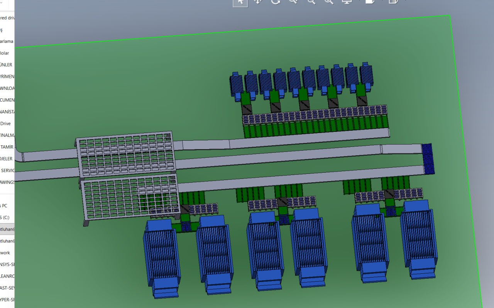
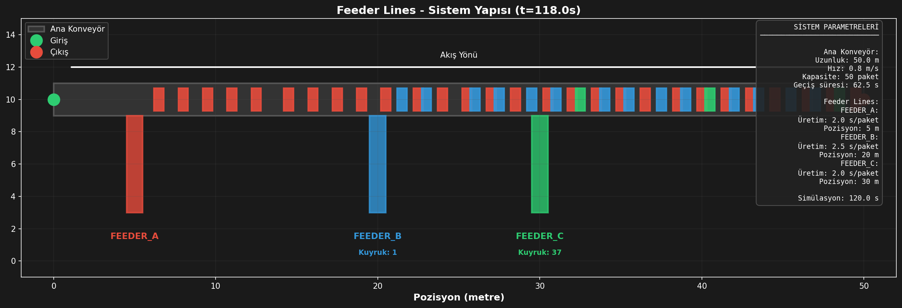
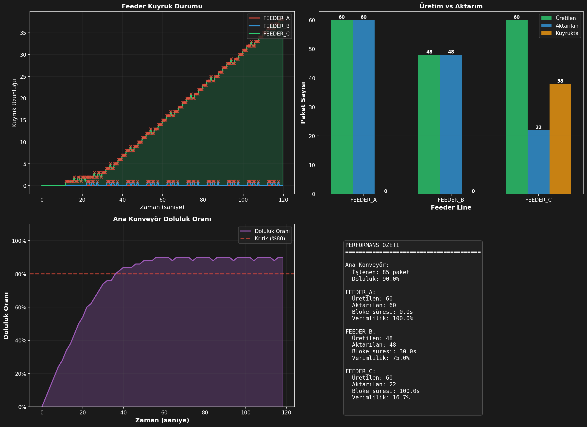

# Konveyör Bant Lojistik Davranış Simülasyonu

[](https://www.python.org/downloads/)
[](https://simpy.readthedocs.io/)
[](https://opensource.org/licenses/MIT)

Ana konveyör ağlarında birden fazla besleme hattı (feeder line) ile **kapasite** ve **koordinasyon** problemlerini analiz eden 2D lojistik simülasyon sistemi.



## İçindekiler

- [Proje Hakkında](#proje-hakkında)
- [Problem Tanımı](#problem-tanımı)
- [Sistem Mimarisi](#sistem-mimarisi)
- [Kurulum](#kurulum)
- [Kullanım](#kullanım)
- [Konfigürasyon](#konfigürasyon)
- [Çıktılar ve Görselleştirmeler](#çıktılar-ve-görselleştirmeler)
- [Ölçüm Metrikleri](#ölçüm-metrikleri)
- [Proje Yapısı](#proje-yapısı)
- [Gelecek Geliştirmeler](#gelecek-geliştirmeler)

## Proje Hakkında

Bu proje, endüstriyel konveyör bant sistemlerinin davranışını simüle etmek için geliştirilmiştir. Özellikle:

- **Feeder Lines (Besleme Hatları)**: Ana konveyöre dik açıyla bağlanan tek yönlü besleme hatları. Sisteme yeni paketlerin beslenmesini sağlar.
- **Main Conveyor Network (Ana Konveyör Ağı)**: Yatay ve dikey uzanan ana taşıma hatları. Paketleri taşıma, birleştirme ve dağıtım işlevlerini yerine getirir.
- **İşlem İstasyonları**: Paketlerin işlendiği, yönlendirildiği veya depolandığı noktalar.

### Simülasyon Süreci

1. Feeder line'lar belirli frekansta paket üretir
2. Paketler ana konveyör ağına aktarılmak için bekler
3. Ana konveyörde yer varsa paket aktarılır, yoksa feeder line beslemeyi durdurur (bloke olur)
4. Paketler ana hat üzerinde taşınır
5. Birleşme noktalarından diğer paketlerle birleşir
6. Dağıtım noktalarından hedeflerine yönlendirilir

## Problem Tanımı

### Kapasite Problemi

| Problem | Açıklama |
|---------|----------|
| Konveyör Kapasitesi | Ana konveyörlerin sınırlı kapasitesini feeder line hızları doğrultusunda en verimli şekilde kullanmak |
| Deadlock Tespiti | Feeder line ve ana konveyör birleşme noktalarında hangi besleme periyodunda sistem kilitlenir? |
| Yığılma Analizi | Feeder line - ana konveyör gecikme süresi çıkartılırken işlem istasyonlarından çıkan paketlerde yığılma yaşanabilir |

### Koordinasyon Problemi

| Problem | Açıklama |
|---------|----------|
| Zamanlama | Feeder line'lar ne zaman beslemeye çıkacak? |
| Öncelik Mekanizması | Priority mechanism dahil edilmeli mi? |
| Optimizasyon Hedefi | Optimal throughput mu, adil dağıtım mı? |

### Kapasite Hesaplama Formülü

```
Kapasite = Konveyör Uzunluğu / (Paket Uzunluğu + Paketler Arası Mesafe)
```

**Örnek**: 50m konveyör, 0.3m paket, 0.5m minimum mesafe için:
```
Kapasite = 50 / (0.3 + 0.5) = 62.5 ≈ 62 paket
```

## Sistem Mimarisi

### Temel Bileşenler

```
┌─────────────────────────────────────────────────────────────────┐
│                        ANA KONVEYÖR                             │
│  ════════════════════════════════════════════════════════════►  │
│       ▲           ▲           ▲                                 │
│       │           │           │                                 │
│  ┌────┴────┐ ┌────┴────┐ ┌────┴────┐                           │
│  │FEEDER_A │ │FEEDER_B │ │FEEDER_C │                           │
│  │(Kırmızı)│ │ (Mavi)  │ │ (Yeşil) │                           │
│  └─────────┘ └─────────┘ └─────────┘                           │
└─────────────────────────────────────────────────────────────────┘
```

### Sınıf Diyagramı

```
┌─────────────────┐     ┌─────────────────┐     ┌─────────────────┐
│     Packet      │     │    Conveyor     │     │   FeederLine    │
├─────────────────┤     ├─────────────────┤     ├─────────────────┤
│ - id            │     │ - id            │     │ - id            │
│ - length        │     │ - length        │     │ - production_rate│
│ - position      │     │ - speed         │     │ - target_conveyor│
│ - source_feeder │     │ - capacity      │     │ - queue         │
│ - path_history  │     │ - packets[]     │     │ - is_blocked    │
├─────────────────┤     ├─────────────────┤     ├─────────────────┤
│ + enter_conveyor│     │ + accept_packet │     │ + start_production│
│ + start_waiting │     │ + has_space_at  │     │ + transfer_process│
│ + stop_waiting  │     │ + get_utilization│    │ + get_statistics │
└─────────────────┘     └─────────────────┘     └─────────────────┘
```

## Kurulum

### Gereksinimler

- Python 3.11 veya üzeri
- pip (Python paket yöneticisi)

### Adım Adım Kurulum

1. **Projeyi klonlayın**
   ```bash
   git clone https://github.com/UstekRFID/ConveyorBelt_LogisticSimulation.git
   cd ConveyorBelt_LogisticSimulation
   ```

2. **Sanal ortam oluşturun** (önerilen)
   ```bash
   python -m venv .venv
   source .venv/bin/activate  # Linux/macOS
   # veya
   .venv\Scripts\activate     # Windows
   ```

3. **Bağımlılıkları yükleyin**
   ```bash
   pip install -r requirements.txt
   ```

4. **Kurulumu doğrulayın**
   ```bash
   python -c "import simpy; import matplotlib; print('Kurulum başarılı!')"
   ```

## Kullanım

### Temel Kullanım

Simülasyonu varsayılan ayarlarla çalıştırmak için:

```bash
python src/mainfeeder.py
```

### Programatik Kullanım

```python
from src.mainfeeder import FeederSimulation, load_config

# Varsayılan config ile
sim = FeederSimulation()
sim.setup()
sim.run()
sim.print_statistics()

# Özel config ile
config = load_config("config/custom_simulation.toml")
sim = FeederSimulation(config)
sim.setup()
sim.run(duration=60.0)  # 60 saniyelik simülasyon
```

### Görselleştirmeler

Simülasyon tamamlandıktan sonra otomatik olarak oluşturulan grafikler:

```python
sim.visualize_system_layout()      # Sistem düzeni
sim.visualize_statistics()          # İstatistik grafikleri
sim.visualize_snapshot_timeline()   # Paket zaman çizgisi
sim.visualize_snapshot_frames()     # Animasyon frame'leri
```

## Konfigürasyon

Tüm simülasyon parametreleri `config/simulation.toml` dosyasından yönetilir:

```toml
# Simülasyon Ayarları
[simulation]
duration = 120.0          # Simülasyon süresi (saniye)
snapshot_interval = 2.0   # Snapshot aralığı (saniye)

# Ana Konveyör Ayarları
[main_conveyor]
id = "MAIN_CONVEYOR"
length = 50.0             # Metre
speed = 0.8               # Metre/saniye
start_position = [0, 10]  # (x, y) koordinatları
end_position = [50, 10]   # (x, y) koordinatları

# Paket Varsayılan Özellikleri
[packet]
default_length = 0.3      # Metre
default_width = 0.3       # Metre
default_height = 0.3      # Metre
min_gap = 0.5             # Paketler arası minimum mesafe

# Görselleştirme Ayarları
[visualization]
theme = "dark"
dpi = 150
output_dir = "output/plots"

# Feeder Renkleri
[visualization.colors]
FEEDER_A = "#E74C3C"      # Kırmızı
FEEDER_B = "#3498DB"      # Mavi
FEEDER_C = "#2ECC71"      # Yeşil
FEEDER_D = "#F39C12"      # Turuncu

# Feeder Line Tanımları
[[feeders]]
id = "FEEDER_A"
production_rate = 0.5     # paket/saniye (her 2 saniyede 1 paket)
connection_point = [2, 5] # Ana konveyöre bağlantı noktası
max_queue_size = 100

[[feeders]]
id = "FEEDER_B"
production_rate = 0.4     # paket/saniye (her 2.5 saniyede 1 paket)
connection_point = [5, 5]
max_queue_size = 100

[[feeders]]
id = "FEEDER_C"
production_rate = 0.5     # paket/saniye (her 2 saniyede 1 paket)
connection_point = [8, 5]
max_queue_size = 100
```

### Yeni Feeder Ekleme

Config dosyasına yeni bir `[[feeders]]` bloğu ekleyerek kolayca yeni feeder tanımlayabilirsiniz:

```toml
[[feeders]]
id = "FEEDER_D"
production_rate = 0.33    # Her 3 saniyede 1 paket
connection_point = [15, 5]
max_queue_size = 50
```

## Çıktılar ve Görselleştirmeler

Simülasyon sonunda `output/plots/` dizininde aşağıdaki dosyalar oluşturulur:

### 1. Sistem Düzeni (`iteration2_system_layout.png`)



Ana konveyör, feeder line'lar, paketler ve sistem parametrelerini gösteren anlık görüntü.

**İçerik:**
- Ana konveyör (gri bant)
- Feeder line'lar (renkli dikey çizgiler)
- Paketler (kaynak feeder'a göre renklendirilmiş)
- Kuyruk uzunlukları
- Sistem parametreleri bilgi kutusu

### 2. İstatistik Grafikleri (`iteration2_statistics.png`)



Dört panelli kapsamlı istatistik görünümü:

| Panel | İçerik |
|-------|--------|
| Sol Üst | Feeder kuyruk uzunlukları zaman serisi |
| Sağ Üst | Üretim vs Aktarım karşılaştırması |
| Sol Alt | Ana konveyör doluluk oranı |
| Sağ Alt | Performans özeti tablosu |

### 3. Zaman Çizgisi (`iteration2_timeline.png`)

Tüm paketlerin konveyör üzerindeki hareketini gösteren zaman-pozisyon grafiği. Her çizgi bir paketi temsil eder ve kaynak feeder'a göre renklendirilmiştir.

### 4. Snapshot Frame'leri (`iteration2_frames.png`)

Simülasyon boyunca belirli aralıklarla alınan anlık görüntüler. Sistemin zaman içindeki evrimini gösterir.

## Ölçüm Metrikleri

### Ana Metrikler

| Metrik | Açıklama | Formül |
|--------|----------|--------|
| **Throughput (Geçiş Hızı)** | Birim zamanda çıkan paket sayısı | `işlenen_paket / süre` |
| **Utilization (Doluluk Oranı)** | Konveyör doluluk yüzdesi | `mevcut_paket / kapasite` |
| **Wait Time (Bekleme Süresi)** | Feeder kuyruğunda geçen süre | `aktarım_zamanı - üretim_zamanı` |
| **Block Time (Bloke Süresi)** | Feeder'ın bloke kaldığı süre | Toplam bloke süreleri |
| **Efficiency (Verimlilik)** | Aktif çalışma oranı | `1 - (bloke_süresi / toplam_süre)` |

### Örnek Çıktı

```
📊 SİMÜLASYON İSTATİSTİKLERİ
======================================================================

🎯 ANA KONVEYÖR: MAIN_CONVEYOR
   Toplam işlenen paket: 59
   Halen üzerinde: 52 paket
   Son doluluk oranı: 104.00%

📦 FEEDER LINES:

   FEEDER_A:
      Üretilen: 60 paket
      Aktarılan: 60 paket
      Kuyrukta: 0 paket
      Toplam bloke süresi: 0.0s
      Kullanım oranı: 100.00%
      Transfer hızı: 0.500 paket/s
      Bloke olma sayısı: 0

   FEEDER_B:
      Üretilen: 48 paket
      Aktarılan: 48 paket
      Kuyrukta: 0 paket
      Toplam bloke süresi: 34.5s
      Kullanım oranı: 71.25%
      Transfer hızı: 0.400 paket/s
      Bloke olma sayısı: 15

   FEEDER_C:
      Üretilen: 60 paket
      Aktarılan: 3 paket
      Kuyrukta: 57 paket
      Toplam bloke süresi: 115.0s
      Kullanım oranı: 4.17%
      Transfer hızı: 0.025 paket/s
      Bloke olma sayısı: 1
```

## Proje Yapısı

```
ConveyorBelt_LogisticSimulation/
│
├── config/
│   └── simulation.toml       # Simülasyon konfigürasyonu
│
├── doc/
│   ├── Lojistik Davranış Simülasyonu Proje Tasarı Raporu.md
│   └── photo_2025-11-04_11-27-09.jpg
│
├── output/
│   └── plots/                # Oluşturulan grafikler
│       ├── iteration2_system_layout.png
│       ├── iteration2_statistics.png
│       ├── iteration2_timeline.png
│       └── iteration2_frames.png
│
├── src/
│   ├── core/
│   │   ├── __init__.py
│   │   ├── packet.py         # Paket veri modeli
│   │   ├── conveyor.py       # Konveyör sınıfı
│   │   └── feeder.py         # Feeder Line sınıfı
│   │
│   └── mainfeeder.py         # Ana simülasyon dosyası
│
├── .venv/                    # Python sanal ortamı
├── .gitignore
├── README.md
└── requirements.txt          # Python bağımlılıkları
```

### Modül Açıklamaları

| Modül | Dosya | Açıklama |
|-------|-------|----------|
| `Packet` | `src/core/packet.py` | Paket veri modeli. Boyut, pozisyon, kaynak, yol geçmişi ve bekleme süresi bilgilerini tutar. |
| `Conveyor` | `src/core/conveyor.py` | Konveyör bant sınıfı. Paket kabulü, hareket simülasyonu, kapasite hesaplama ve doluluk takibi yapar. |
| `FeederLine` | `src/core/feeder.py` | Besleme hattı sınıfı. Paket üretimi, kuyruk yönetimi, blokaj durumu ve transfer işlemlerini yönetir. |
| `FeederSimulation` | `src/mainfeeder.py` | Ana simülasyon orkestratörü. Sistem kurulumu, çalıştırma ve görselleştirme işlevlerini içerir. |

## Gelecek Geliştirmeler

### Planlanan Özellikler

- [ ] **Birleştirme Noktası Algoritmaları**
  - FIFO (First In, First Out)
  - Round Robin
  - Priority-based scheduling

- [ ] **Çoklu Konveyör Desteği**
  - Paralel konveyör hatları
  - Merge/Split noktaları
  - Çapraz geçişler

- [ ] **Gelişmiş Metrikler**
  - Deadlock tespiti ve önleme
  - Darboğaz analizi
  - Enerji tüketimi simülasyonu

- [ ] **Gerçek Zamanlı Görselleştirme**
  - Canlı animasyon
  - İnteraktif kontrol paneli
  - Web tabanlı dashboard

- [ ] **Optimizasyon Modülleri**
  - Genetik algoritma ile parametre optimizasyonu
  - Makine öğrenmesi tabanlı tahminleme
  - Simulated annealing

## Katkıda Bulunma

1. Bu repo'yu fork edin
2. Feature branch oluşturun (`git checkout -b feature/amazing-feature`)
3. Değişikliklerinizi commit edin (`git commit -m 'feat: Add amazing feature'`)
4. Branch'inizi push edin (`git push origin feature/amazing-feature`)
5. Pull Request açın

## Lisans

Bu proje MIT lisansı altında lisanslanmıştır. Detaylar için [LICENSE](LICENSE) dosyasına bakın.

## İletişim

**Ustek RFID** - Lojistik Simülasyon Ekibi

---

*Bu proje, endüstriyel otomasyon ve lojistik sistemlerinin daha iyi anlaşılması ve optimize edilmesi amacıyla geliştirilmektedir.*
